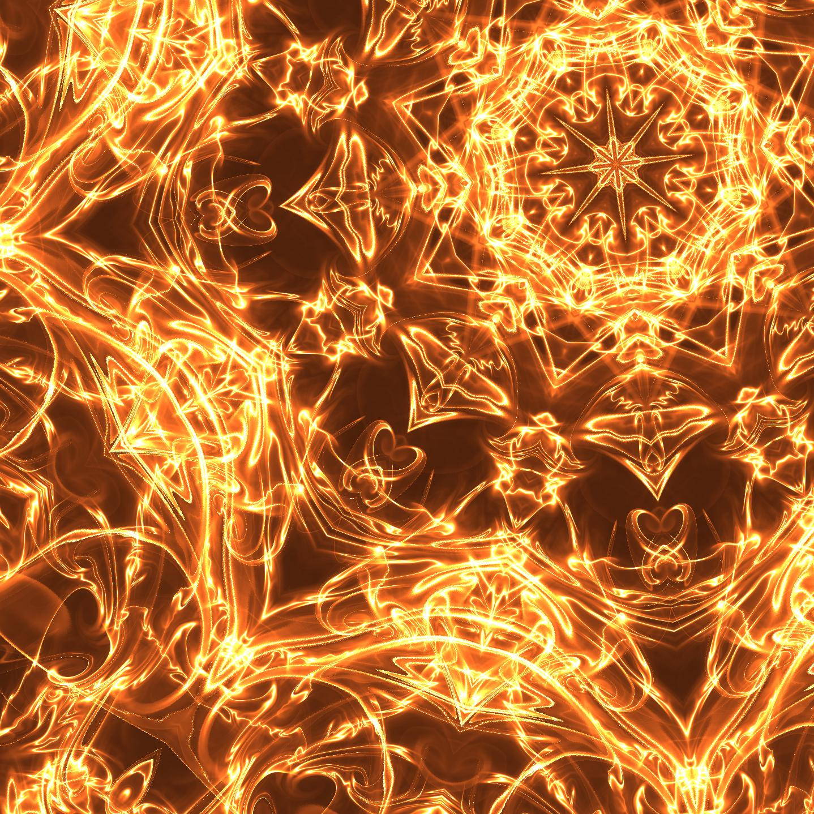
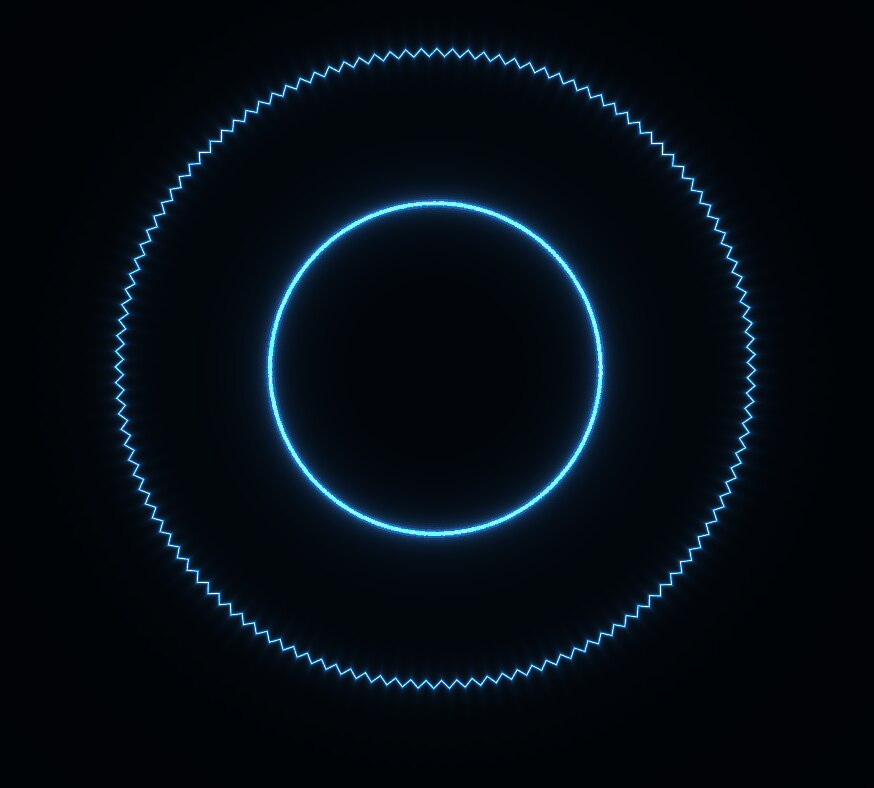
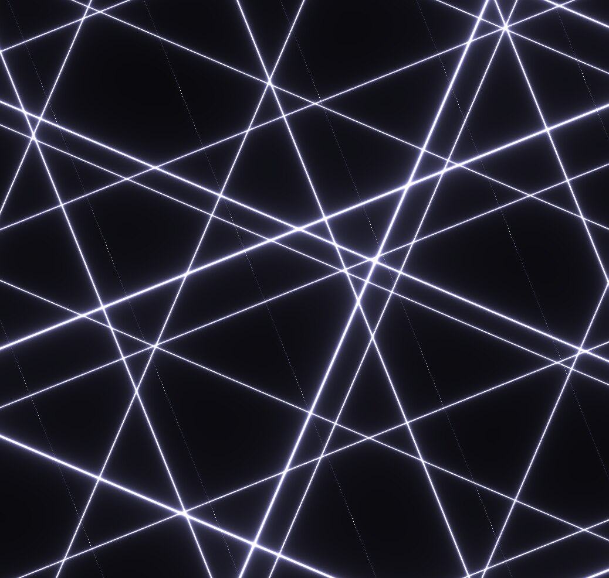
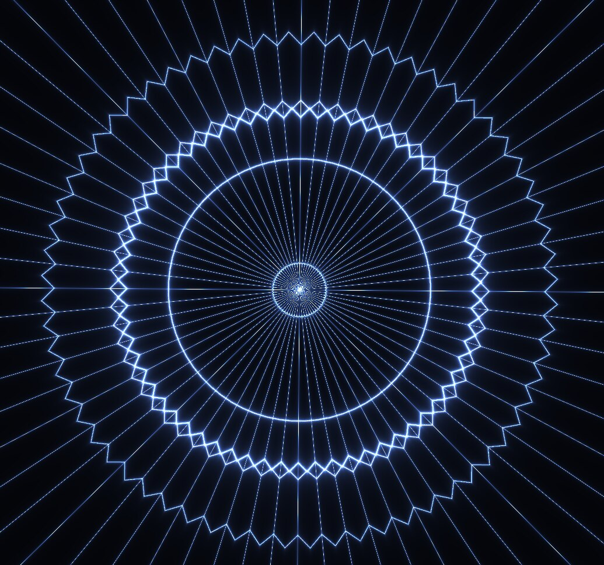

# Wallpaper Engine Plasma Symmetry

This was once a 2.5D wallpaper in steam workshop for the wallpaper engine

Meanwhile I have removed it because it was too photosensitive even for me

I have had the impression that it does more harm than good

It looks so beautiful at first that you want to look inside and after about a minute you feel dizzy.

That was the same for people from my environment

So I removed it to not harm more people.

I for example was dizzy for more than 2 weeks because I was exposed to it for 9 hours (while I had programmed it).

You can compile it at your own risk

I keep this repo as a reminder of a not good period of my life

## Compilation guide (as I said before: at your own risk)
First buy the [Wallpaper Engine](https://store.steampowered.com/app/431960/Wallpaper_Engine/) on Steam, otherwise the wallpaper can't be executed

Wallpaper Engine only works on Windows

Install [Node.js](https://nodejs.org/de/download) on your Computer. I recommend the LTS version.

Open your terminal (anywhere)

Type `npm install -g yarn` to install the yarn package manager globally on your computer

Download this project with the "Code" button and "Download Zip"

Place and extract the zip in an place of your choise

Open your terminal inside this new project folder

Type just `yarn` in the terminal to install all dependencies

Run the build script by typing `yarn run build`

A new folder with the name "dist" appears in your project folder

Open the wallpaper engine wallpaper editor and press the create new wallpaper button

Select the "index.html" file of the new "dist" folder with all its dependencies inside the dist folder like described [here](https://docs.wallpaperengine.io/en/web/first/gettingstarted.html)

The wallpaper is now ready. You can use the json files from the "examples" folder to test some preconfigurations.

### If you feel dizzy or bad or getting concentration problems, stop it!

I don't want you to have the same experience as I did,
I was also unable to work for a week because of the dizziness.
And this is not a joke or sarcasm but personal experience.

## Pictures

### Psychedelic Sun

### Cosmic Strings

### Dancing Plasma

### Light Tunnel

### Singularity

### Spacetime

### Symmetric Grid

### White Singularity

